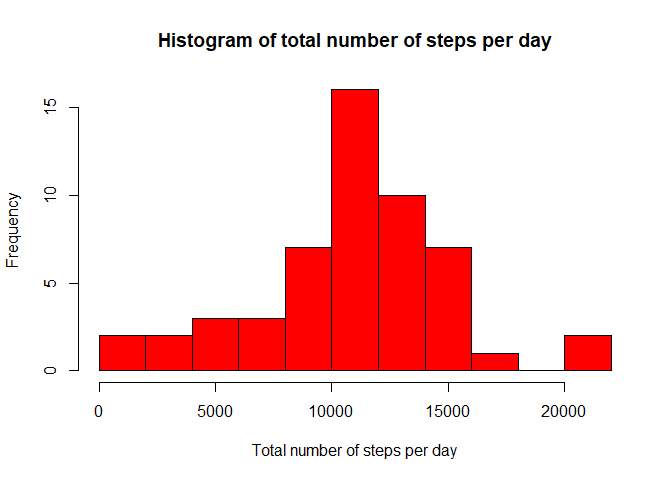
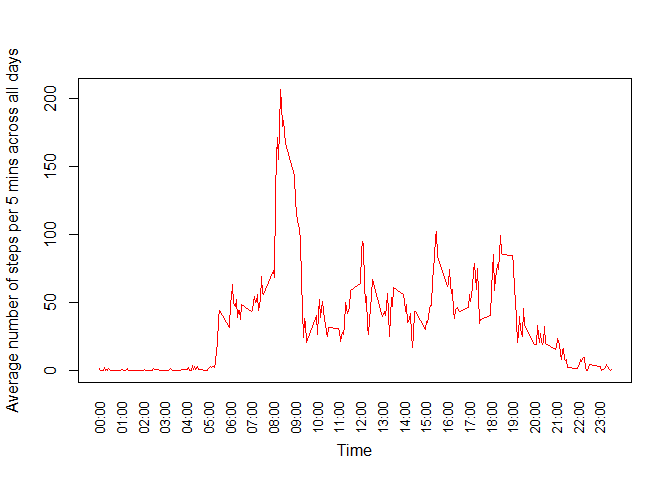
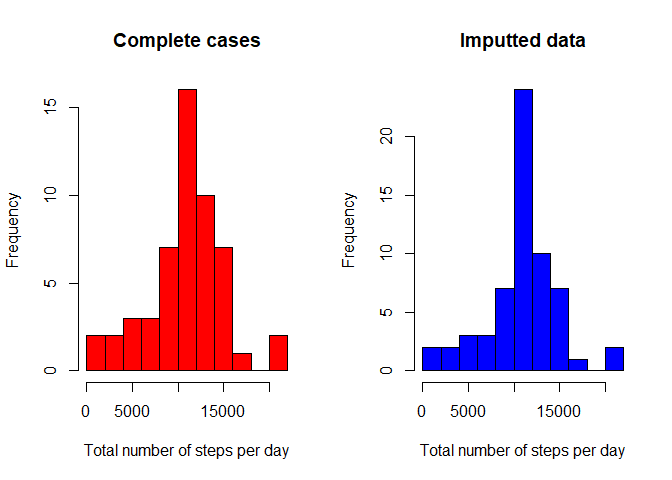
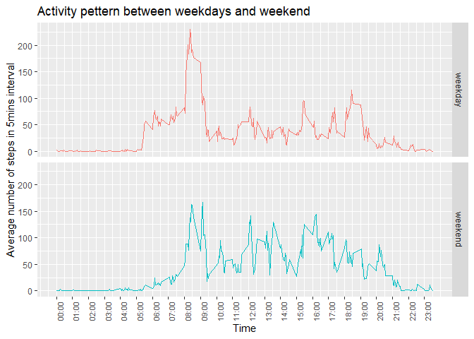

  
  
## Assignment: Introduction  
  
This assignment makes use of data from a personal activity monitoring device. Data at 5 mins intervals through out the day during months of October to November 2012. First part of analysis excludes missing data, second part uses imputing for the missing data.  

Dataset and code is stored with the Rmd file. Md file and html are submitted.  


-----------------------------------------------------------------

## Data loading and preprocessing  

#### Downloading the data (skip if not required)  


```r
fileUrl <- "https://d396qusza40orc.cloudfront.net/repdata%2Fdata%2Factivity.zip"
download.file(fileUrl, destfile = "./Dataset.zip", method = "curl")
unzip("./Dataset.zip", overwrite = TRUE)
```
  
  
#### Reading & viewing the data  
  

```r
activity <- read.csv("activity.csv", header = TRUE)
head(activity, 2)
```

```
##   steps       date interval
## 1    NA 2012-10-01        0
## 2    NA 2012-10-01        5
```
  
  
#### Formatting time / date  
  

```r
activity$time <- paste0(formatC(as.integer(activity$interval/100), width=2, flag="0"), ":", formatC(as.integer(activity$interval%%100), width=2, flag="0"))
activity$datetime <- as.POSIXlt(paste(activity$date, activity$time), format="%Y-%m-%d %H:%M", tz="GMT")
summary(activity)
```

```
##      steps            date              interval          time          
##  Min.   :  0.00   Length:17568       Min.   :   0.0   Length:17568      
##  1st Qu.:  0.00   Class :character   1st Qu.: 588.8   Class :character  
##  Median :  0.00   Mode  :character   Median :1177.5   Mode  :character  
##  Mean   : 37.38                      Mean   :1177.5                     
##  3rd Qu.: 12.00                      3rd Qu.:1766.2                     
##  Max.   :806.00                      Max.   :2355.0                     
##  NA's   :2304                                                           
##     datetime                  
##  Min.   :2012-10-01 00:00:00  
##  1st Qu.:2012-10-16 05:58:45  
##  Median :2012-10-31 11:57:30  
##  Mean   :2012-10-31 11:57:30  
##  3rd Qu.:2012-11-15 17:56:15  
##  Max.   :2012-11-30 23:55:00  
## 
```
  
  
#### Removing missing values  
  

```r
activityComplete <- na.omit(activity)
```


------------------------------------------------------------

## Analysis: Total number of steps per day  
  
>**What is mean total number of steps taken per day?**
For this part of the assignment we ignore the missing values in the dataset.  
  
  >1. Calculate the total number of steps taken per day
  >2. Make a histogram of the total number of steps taken each         day.
  >3. Calculate and report the mean and median of the total            number of steps taken per day.  
  

#### Processing the data: calculating total number of steps per day  


```r
activityDayComplete <- 
  activityComplete %>%
  group_by(date) %>%
  summarize(sum = sum(steps))
```

```
## `summarise()` ungrouping output (override with `.groups` argument)
```
  
  
#### Plotting histogram of total number of steps per day  


```r
par(mfrow=c(1,1))
hist(activityDayComplete$sum, col = "red", breaks = 8, xlab = "Total number of steps per day", main = "Histogram of total number of steps per day")
```

<!-- -->
  
  
#### Calculating mean and median of total number of steps per day


```r
meanDailySteps <- mean(activityDayComplete$sum) # 10766.19
medianDailySteps <- median(activityDayComplete$sum) # 10765
```
  
  
**Mean of total number of steps taken each days is 1.0766189\times 10^{4} and Median of total number of steps taken each days is 10765.**
  
  
--------------------------------------------------------------

## Analysis: Daily activity pattern  

>**What is the average daily activity pattern?**
  
  >1. Make a time series plot of the 5-minute interval (x-axis)        and the average number of steps taken, averaged across all       days (y-axis)
  >2. Which 5-minute interval, on average across all the days in       the dataset, contains the maximum number of steps?  
  
  
#### Plotting time series of average number of steps averaged in intervals across all days  


```r
activityDayComplete2 <- 
  activityComplete %>%
  group_by(interval) %>%
  summarize(average = mean(steps))
```

```
## `summarise()` ungrouping output (override with `.groups` argument)
```

```r
timeBreaks <- activityDayComplete2$interval[seq(1, 288, 12)]
timeLabels <- activity$time[seq(1, 288, 12)]

with(activityDayComplete2, plot(interval, average, type = "l", lwd = 1.5, col = "red", xaxt="n", xlab = "Time", ylab = "Average number of steps per 5 mins across all days"))
axis(1, at = timeBreaks, labels = timeLabels, las = 2, tck = 0, cex.axis = 0.8)
```

<!-- -->
  
  
#### Finding time with a maximum average number of steps  
  
Time with maximum average number of steps in 5mins interval across all days is 08:35 and the maximum average number of steps in 5mins interval across all days is 206.17.  

  
----------------------------------------------------------------

## Analysis: Total number of steps per day with imputting missing data  

  >1. Calculate and report the total number of missing values in       the dataset.
  >2. Devise a strategy for filling in all of the missing values       in the dataset. For example, you could use the mean/median       for that day, or the mean for that 5-minute interval, etc.
  >3. Create a new dataset that is equal to the original dataset       but with the missing data filled in.
  >4. Make a histogram of the total number of steps taken each         day and Calculate and report the mean and median total           number of steps taken per day. 
  >5. Do these values differ from the estimates from the first         part of the assignment? What is the impact of imputing           missing data on the estimates of the total daily number of       steps?  
  

#### Calculating number and percentage of missing values  
  
Total number of missing values in the dataset is 2304 which accounts for 13.11% of data.  
  
  
#### Imputting missing values with mean value of steps per interval across all days  
  

```r
newActivity <- activity %>% 
    group_by(date) %>% 
    mutate(steps = ifelse(is.na(steps), activityDayComplete2$average[is.na(steps)], steps))

# Simple test of imputting missing data
test <- sample(which(is.na(activity)), size = 1) # take random missing data
testInterval <- activity$interval[test] # find interval foor the random data
activity$steps[test] # see original data
```

```
## [1] NA
```

```r
# Do data with imputted missing value equals to mean value for selected test interval?
newActivity$steps[test] == activityDayComplete2$average[activityDayComplete2$interval == testInterval] 
```

```
## [1] TRUE
```
  
  
#### Processing the data: calculating sum of steps per day (for imputted data)  


```r
newActivityDay <- 
  newActivity %>%
  group_by(date) %>%
  summarize(sum = sum(steps))
```

```
## `summarise()` ungrouping output (override with `.groups` argument)
```
  
  
#### Plotting histogram of total number of steps per day (for imputted data)  


```r
par(mfcol = c(1,2))
hist(activityDayComplete$sum, col = "red", breaks = 8, xlab = "Total number of steps per day", main = "Complete cases")
hist(newActivityDay$sum, col = "blue", breaks = 8, xlab = "Total number of steps per day", main = "Imputted data")
```

<!-- -->
  
  
#### Calculating mean and median of total number of steps per day (for imputted data)  


```r
meanDailySteps2 <- mean(newActivityDay$sum) # 10766.19
medianDailySteps2 <- median(newActivityDay$sum) # 10765
```

Mean of total number of steps taken each days for imputted data is 1.0766189\times 10^{4}. The change is 0 - no change as mean value used in imputting!
Median of total number of steps taken each days for imputted data is 1.0766189\times 10^{4}. Increase just by 1.19 steps.  
  
  
Imputting missing data using mean value have minor effect on the distrubution. There is a visible increase of frequency for mean values from 18 to 25 - which might have been expected. Using different imput method might have different result.
  
-------------------------------------------------------------

## Analysis: Activity pattern for weekdays and weekend  

>**Are there differences in activity patterns between weekdays and weekends?**

  >1. Create a new factor variable in the dataset with two levels       – “weekday” and “weekend” indicating whether a given date        is a weekday or weekend day.
  >2. Make a panel plot containing a time series plot of the           5-minute interval (x-axis) and the average number of steps       taken, averaged across all weekday days or weekend days          (y-axis).   


#### Adding new factor for weekdays and weekend  


```r
newActivity$weekday <- ifelse(newActivity$datetime$wday == 0 | newActivity$datetime$wday == 6, "weekend", "weekday")
newActivity$weekday <- as.factor(newActivity$weekday)
```
  
  
#### Plotting time series of average number of steps averaged in intervals across weekdays / weekends  


```r
newActivityWday <- 
  newActivity %>%
  group_by(weekday, interval) %>%
  summarize(average = mean(steps))
```

```
## `summarise()` regrouping output by 'weekday' (override with `.groups` argument)
```

```r
ggplot(newActivityWday, aes(x = interval, y = average, color = weekday)) + geom_line() + facet_grid(weekday~.) + labs(x = "Time", y = "Average number of steps in 5mins interval", title = "Activity pettern between weekdays and weekend") + theme(legend.position = "none", axis.text.x = element_text(size = 8, angle = 90)) + scale_x_continuous(breaks = timeBreaks, labels = timeLabels)
```

<!-- -->
  
  
#### Key findings from comperison of the weekday and weekend patterns  

  * Weekday activity starts early (from 05:00-06:00), with strong     peak at 08:00-09:00. The activity through out the day is         medium / low, with the activity visibly decreasing after         19:00. 
  * Weekend activity starts after 07:00, with peak at                08:00-09:00. The activity stays on similar level through out     the day, slowly decreasing after 20:00-2100.
  * From the data provided, we can conclude that there is visible     activity pattern difference on weekdays and weekend. 

  
---------------------------------------------------------------
*Thank you for reviewing my Assignment!*
